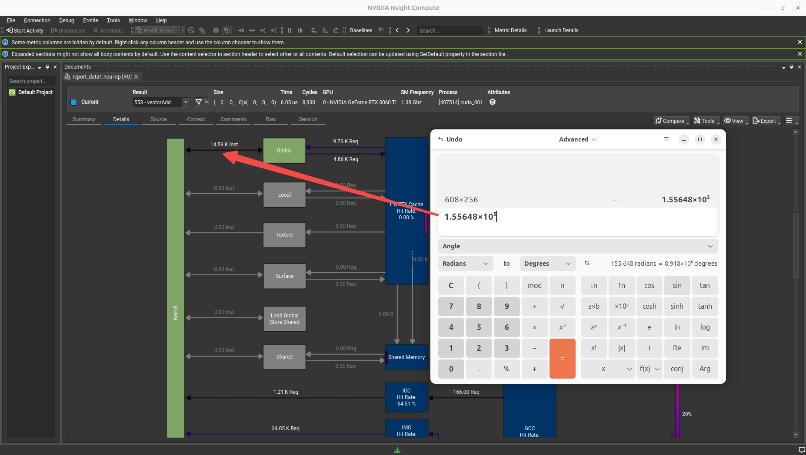
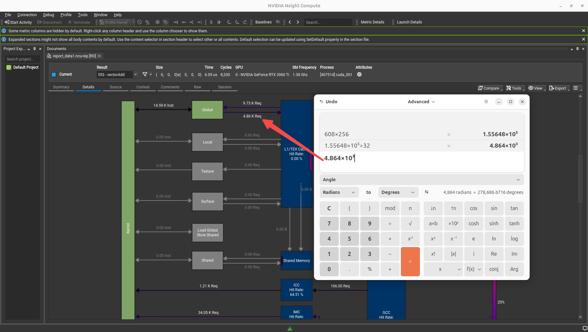
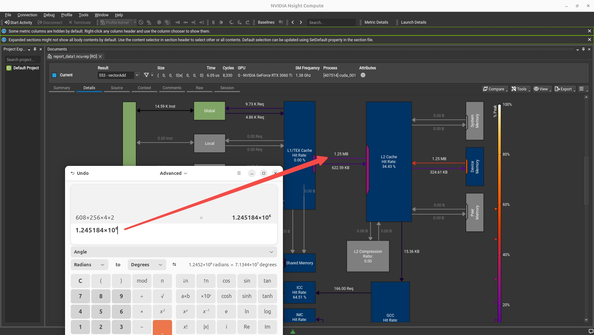
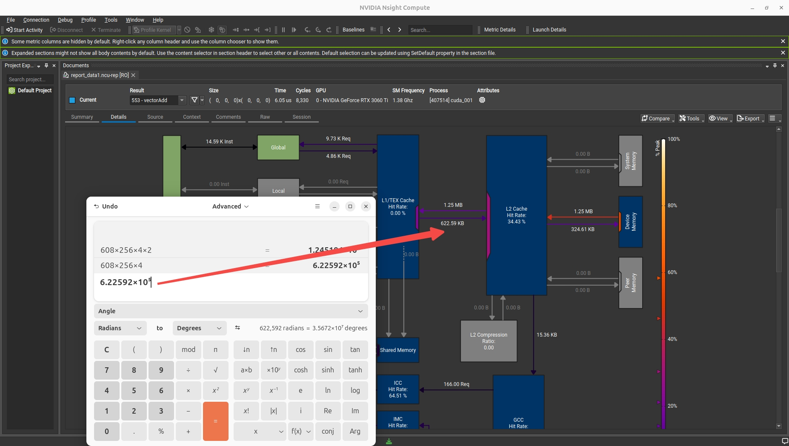

# ncu 分析示例

<div align="center">


</div>

## 线程数目计算

由于并非一个线程给一个指令（单指令多线程），所以实际数值要低于理论数值

```
608 * 256 = 1.55648×10⁵
```

<div align="center">



</div>

## 写入指令数目计算

此处除 32 与 Warp size 相关，这里也可以算出读指令数目 608 * 256 * 2 / 32 = 9.728×10³

```
608 * 256 * 1 / 32 = 4.864×10³
```

<div align="center">



</div>

## 读取数据计算

```
608 * 256 * 4(int) * 2(kernel 每次调用读两个 int) = 1.245184×10⁶
```

<div align="center">



</div>

## 写入数据计算

```
608 * 256 * 4(int) * 1(kernel 每次调用读一个 int) = 6.22592×10⁵
```

<div align="center">



</div>

## 不同 Grid 和 Block Size 下的性能比较
 1. Compute Throughput（计算吞吐量）
    
    含义：表示GPU 计算单元的利用率，即内核在执行过程中，计算资源（如 CUDA 核心）被有效利用的比例（以百分比呈现）。
    
    越高越好：数值接近 100% 时，说明计算资源几乎被 “占满”，没有太多闲置；如果数值低，可能是计算任务不够密集，或被内存等其他操作阻塞。
 2. Memory Throughput（内存吞吐量）
    
    含义：表示GPU 内存带宽的利用率，即内核在访问内存（全局内存、共享内存等）时，实际使用的带宽占 GPU 理论最大内存带宽的比例（以百分比呈现）。
    
    越高越好：数值高说明内存访问的效率高（比如内存访问被 “合并”、缓存命中率高）；数值低则可能存在内存访问不高效的问题（如非合并访问、内存碎片化）。

<div align="center">


</div>
